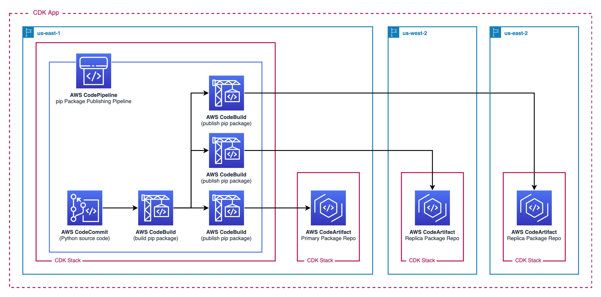

## Multi Region Package Publishing Pipeline

This git repository is designed to demonstrate how to build and publish pip packages to CodeArtifact Repositories in Multiple Regions by using CodePipeline and the AWS CDK.

### Architecture



### Prerequisites

- Have NPM installed (You can download it by [installing Node.js](https://nodejs.org/en/download/))
- Have the AWS CLI [installed](https://docs.aws.amazon.com/cli/latest/userguide/getting-started-install.html) and [configured](https://docs.aws.amazon.com/cli/latest/userguide/cli-configure-quickstart.html)
- Have the AWS CDK [installed](https://docs.aws.amazon.com/cdk/v2/guide/getting_started.html#getting_started_install) and your AWS Account [bootstrapped](https://docs.aws.amazon.com/cdk/v2/guide/getting_started.html#getting_started_bootstrap) for all regions to be used
  - This sample uses regions `us-east-1`, `us-east-2`, and `us-west-2`; bootstrap both these regions
  - Be sure you either have AWS Environment variables set or an AWS CLI profile to [provide CDK your Credentials](https://docs.aws.amazon.com/cdk/v2/guide/cli.html#cli-environment)

## Deployment instructions:

### Install the CDK Application code

- [Fork the aws-samples/multi-region-python-package-publishing-pipeline](https://github.com/aws-samples/multi-region-python-package-publishing-pipeline/fork) repository
- `git clone git@github.com:<YOUR_GITHUB_USERNAME>/multi-region-python-package-publishing-pipeline.git`
- `cd multi-region-python-package-publishing-pipeline`
- `npm i`
- (Optional) Override default configurations for the CodeArtifact domainName, repositoryName, primaryRegion, and replicaRegion
  - navigate to `./bin/multiregion_package_publishing.ts` and update relevant fields

### Deploy the CDK Application

- `cdk deploy --all` from the app root directory `multi-region-python-package-publishing-pipeline/`
  - Enter `y` for all prompts

## Investigate what you've built

Look at the CodePipeline that has three stages (Source, Build, and Publish) and the monitor the CodeBuild Projects in the Build/Publish phases while you wait for the pipeline to complete. After ~7 minutes, the pipeline should have a status of success

Navigate to the CodeCommit Repository which has the Source Code for your Custom pip Package. Follow the instructions in the CodeCommit `PackageSourceCode` Repository's README (source code originates from [this directory](./lib/custom-package-source-code)) to add a commit to the `main` branch and trigger the pipeline to run again

## Test an install of the package

- Configure your local `pip` to use the CodeArtifact Primary (or Replica) Repository `aws codeartifact login --tool pip --repository package-artifact-repo --domain custom-package-domain --domain-owner <ACCOUNTID>`
- Download the package: `pip3 install mypippackage==1.0.0`
- Start the Python REPL `python3`

```
>>> import customPackage1
>>> from customPackage1 import module1, module2
>>> from customPackage1.module2 import function2

>>> customPackage1.module1.function1()
This is function1

>>> module1.function1()
This is function1

>>> module2.function2()
This is function2

Time to call function1...
This is function1

>>> function2()
This is function2

Time to call function1...
This is function1
```

## Clean Up

- Destroy cloud resources by running `cdk destroy --all` from the root app directory `multi-region-python-package-publishing-pipeline/`
- Reconfigure pip to look at the standard pypi repository `pip3 config set global.index-url https://pypi.org/simple`

## Security

See [CONTRIBUTING](CONTRIBUTING.md#security-issue-notifications) for more information.

## License

This library is licensed under the MIT-0 License. See the LICENSE file.
