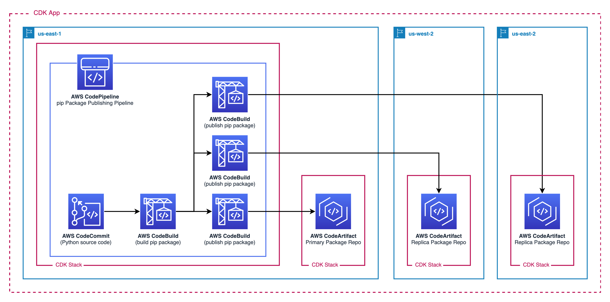

## Multi Region Package Publishing Pipeline

This git repository is designed to demonstrate how to build and publish pip packages to CodeArtifact Repositories in Multiple Regions by using CodePipeline and the AWS CDK.

## Architecture



## Prerequisites

- Have NPM installed
- Have the AWS CDK CLI installed
- Have the AWS CLI installed and configured (e.g. profile)
- Have your AWS Account's regions [bootstrapped](https://docs.aws.amazon.com/cdk/v2/guide/bootstrapping.html) (this sample uses regions `us-east-1` and `us-west-2`)

## Instructions to deploy in your environment:

- `git clone <git-remote-repo-location>`
- `cd <git-repo-name>`
- `npm i`
- (Optional) configure the CodeArtifact domainName, repositoryName, primaryRegion, and replicaRegion
  - navigate to `./bin/multiregion_package_publishing.ts` and update relevant fields
- `cdk deploy --all`
  - Enter `y` for all prompts
- `cd ..` to exit out of the CDK directory

## Investigate what you've built

Look at the CodePipeline that has two stages (Source and Build) and the several actions in the Build Stage (Build Package, Publish Package to Primary Region, Publish Package to Replica Region)

Navigate to the CodeCommit Repository which has the Source Code for your Custom pip Package. Follow the instructions in the CodeCommit [PackageSourceCode Repository's README](./lib/custom-package-source-code/README.md) to add a commit to the `main` branch and trigger the pipeline

## Test an install of the package

- Configure your local `pip` to use the CodeArtifact Primary (or Replica) Repository `aws codeartifact login --tool pip --repository package-artifact-repo --domain custom-package-domain --domain-owner <ACCOUNTID>`
- Download the package: `pip3 install mypippackage==1.0.0`
- Start the Python REPL `python3`

```
>>> import customPackage1
>>> from customPackage1 import module1, module2
>>> from customPackage1.module2 import function2

>>> customPackage1.module1.function1()
This is function1

>>> module1.function1()
This is function1

>>> module2.function2()
This is function2

Time to call function1...
This is function1

>>> function2()
This is function2

Time to call function1...
This is function1
```

## Clean Up

- `cd <git-repo-name>`
- Destory cloud resources `cdk destroy --all`
- Configure pip to look at the standard pypi repository `pip3 config set global.index-url https://pypi.org/simple`

## Security

See [CONTRIBUTING](CONTRIBUTING.md#security-issue-notifications) for more information.

## License

This library is licensed under the MIT-0 License. See the LICENSE file.
